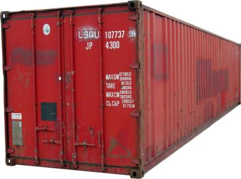

# Containers! They are everywhere !1!!



Containers and the intuitive way of working with them are one of the features of Python that can make you productive with the language right from the start. They are also an integral part of the internal language mechanics. Understanding them is essential to understand how Python as a language ticks.

## What can I put in?

That depends on the container. Lists are the most welcoming containers, you can put in anything. Other containers (e.g. sets and tuples and dicts for their keys) need something hashable (we see that later in demo).

## Native Containers are iterable

All native container types can be iterated over by using a `for ... in` loop : [demo](iterating.ipynb)

## What turns an object into a container? 

One central language mechanic of Python is the idea of simple protocols implementing functionality that is accessed by central language constructs. If a user defined class implements these protocols they can be used just like native objects with those capabilities.

To turn a class into a container the object needs a `__contains__` method that takes one value that needs to be checked for containment. If that is the case you can use the `in` operator to check if an object is in your container just like you would do with a native list or dictionary.

```python
myObject = 1
myContainer = [myObject]
if myObject in myContainer:
    print "WOHOO!"
```

OUT:

    WOHOO!
    
This works exactly the same for classes that you define and equip with a `__contains__` method

[demo](inspect-objects.py)

# Containers as part of the Python language mechanics

Every module contains dictionaries holding all the objects in the namespace of that module. Check out the `locals()` and `globals()` builtins

Everything in Python is an object and almost every object contains a dictionary holding attributes and methods
